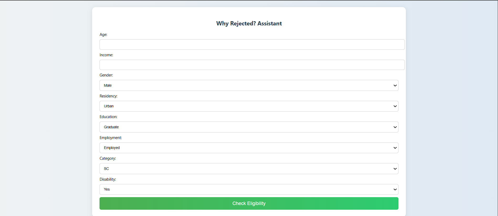
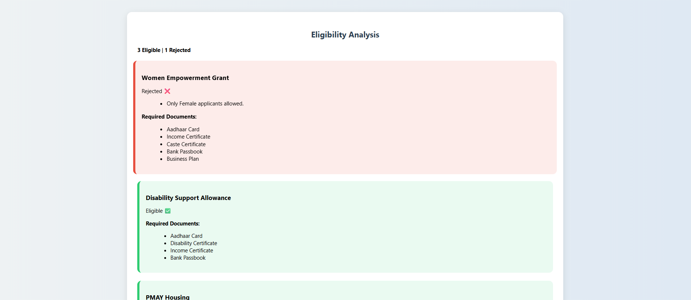
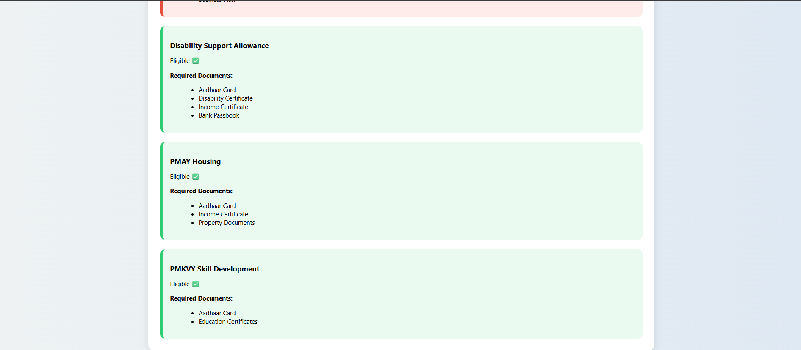

# 🏛️ Government Scheme Eligibility Checker


A Flask-based web application that helps users verify their eligibility for multiple government welfare schemes using a rule-based decision system. The application provides transparent rejection reasons and displays the required documents before users apply.

---

## 📌 Features

- Rule-based eligibility verification
- Supports multiple government schemes
- Transparent rejection reasons
- Displays required documents
- User-friendly interface
- Fast eligibility checking
- JSON-based data management

---

## 🛠 Technologies Used

- Python
- Flask
- HTML5
- CSS3
- JSON

---

## 📂 Project Structure

```
Government-Scheme-Eligibility-Checker
│
├── app.py
├── schemes.json
├── requirements.txt
├── README.md
├── LICENSE
├── .gitignore
│
├── static
│   ├── Style.css
│   └── screenshots
│
└── templates
    ├── index.html
    └── result.html
```

---

## 🚀 Installation

Clone the repository

```bash
git clone https://github.com/meghanamothe12/Government-Scheme-Eligibility-Checker.git
```

Go inside the folder

```bash
cd Government-Scheme-Eligibility-Checker
```

Install dependencies

```bash
pip install -r requirements.txt
```

Run the project

```bash
python app.py
```

Open your browser

```
http://127.0.0.1:5000
```

---

## 📸 Screenshots

### Home Page



### Eligible Result



### Rejected Result



---

## 🎯 Future Enhancements

- Database Integration
- Aadhaar Authentication
- AI-based Scheme Recommendation
- Admin Dashboard
- Multi-language Support
- Mobile Responsive Design

---

## 👩‍💻 Author

**Mothe Meghana**

GitHub: https://github.com/meghanamothe12

---

## 📜 License

This project is licensed under the MIT License.
